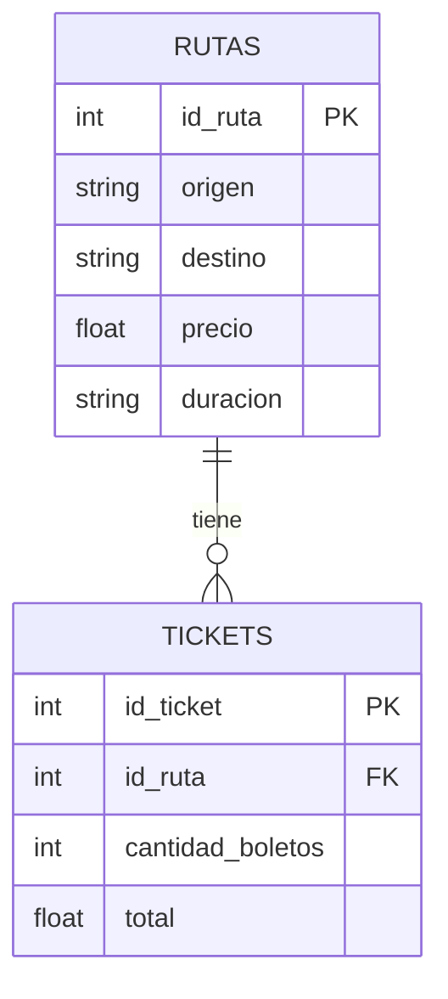
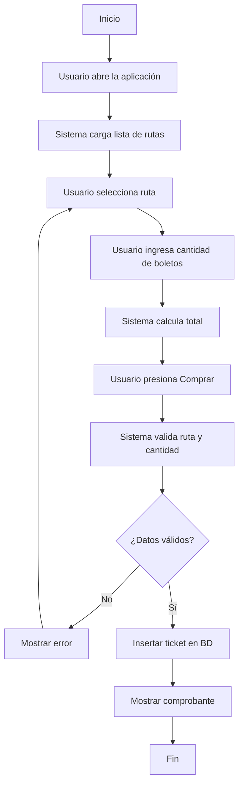
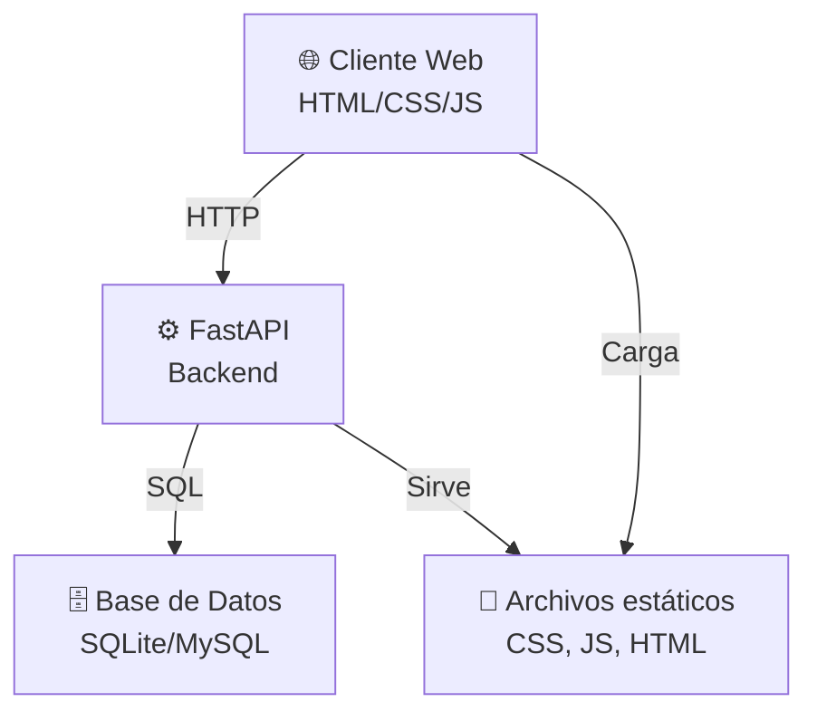
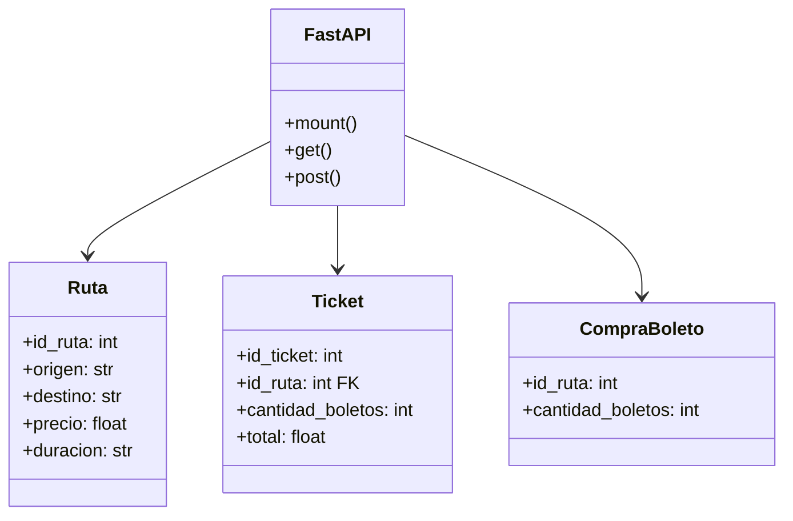
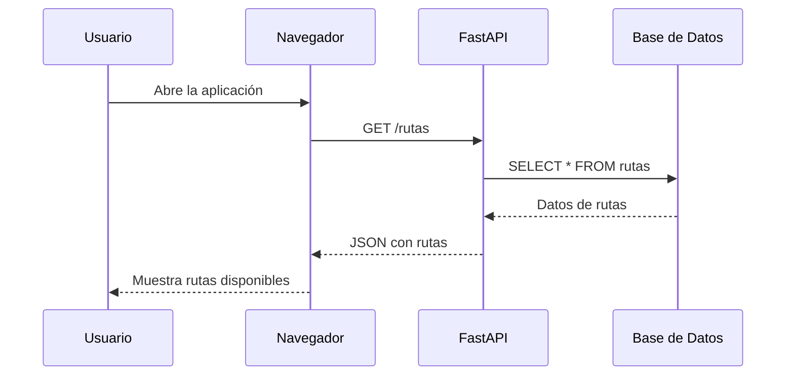
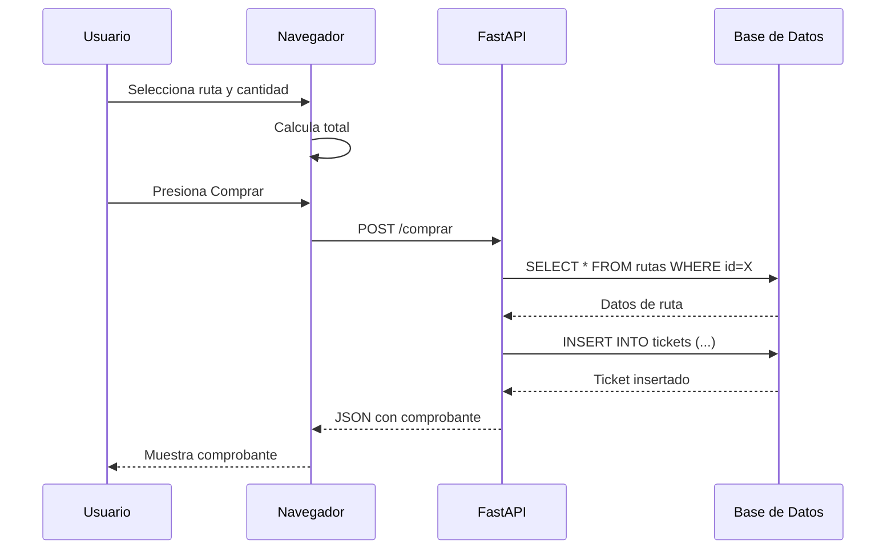

# Diagramas - Autobuses Wampis

## Diagrama Entidad-Relación (ER)

## Diagrama de Flujo - Proceso de Compra

## Diagrama de Arquitectura

## Diagrama UML - Clases

## Diagrama de Secuencia - Consultar Rutas

## Diagrama de Secuencia - Comprar Boletos

